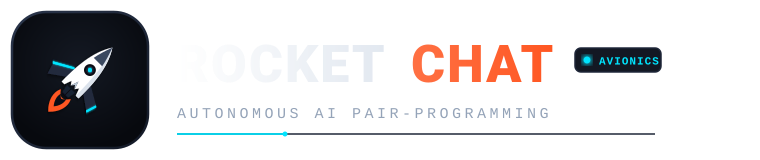

<p align="center">
  <picture>
    
  </picture>
</p>

<p align="center">
  <strong>Autonomous AI Pair-Programming Platform &amp; Mission Control Cockpit</strong>
</p>

<p align="center">
  
  
  
  
  
  
</p>

---

## Overview

**Rocket Chat** is an autonomous AI pair-programming platform designed for engineering teams that require safe, observable, and isolated agent execution. It couples a multi-tenant agent execution engine with pluggable compute sandboxes (Docker and Kubernetes), an LLM Gateway with Bring-Your-Own-Key (BYOK) routing, Slack Assistant integration via Socket Mode, and a Next.js 15 developer cockpit with native dark/light modes.

> **Note on AI Context:** "Rocket" is the platform's visual identity and UI theme. The underlying AI agents are strictly general-purpose software engineers, application security auditors, and technical writers.

### Key Capabilities

- **Isolated Compute Sandboxes:** Pluggable execution driver implementing `SandboxDriverProtocol` supporting local Docker daemon containers and Kubernetes multi-tenant Pods with non-root security contexts.
- **Modern Pair-Programming Cockpit:** Next.js 15 interface featuring continuous flight streams, real-time collapsible thinking/reasoning blocks, in-stream decision gates, side-by-side Monaco diffs, and streaming virtual terminal output.
- **Hierarchical Agent Core:** ReAct agent engine with tool dispatching (`view_file`, `replace_file_content`, `write_to_file`, `run_command`, `ask_question`), context compaction, and loop guards.
- **Universal LLM Gateway:** Unified LiteLLM proxy router supporting Anthropic, OpenAI, DeepSeek, and OpenRouter with BYOK AES-256 encryption.
- **Embedded Slack Assistant:** Socket Mode integration enabling team members to summon autonomous agents directly in workspace threads.

---

## Monorepo Structure

```text
rocket-chat/
├── apps/
│   ├── api/                 # FastAPI REST & WebSocket Control Plane (Python 3.12+)
│   └── web/                 # Next.js 15 Cosmic Telemetry Cockpit (TypeScript, Tailwind)
├── packages/
│   ├── agent-core/          # Autonomous reasoning loop & tool executor
│   ├── config-engine/       # Layered configuration & environment resolution
│   ├── git-engine/          # Git driver with atomic commits & co-authors
│   ├── llm-gateway/         # LiteLLM proxy router with encrypted BYOK tenancy
│   ├── sandbox-driver/      # Pluggable Docker & Kubernetes sandboxes
│   └── slack-assistant/     # Slack Socket Mode bot integration
├── specifications/
│   └── interfaces/          # Subsystem protocols & abstract contracts (Single Source of Truth)
├── deploy/                  # Docker Compose stacks, Kind manifests, & Helm charts
├── doc/                     # Living user and architecture documentation (Mintlify)
└── tests/                   # Automated unit, integration, and E2E test suites
```

---

## Installation Guides

You can run Rocket Chat using **Docker Compose** (recommended for quick evaluation), a **Local Development Stack** (for active coding with hot-reloading), or a **Local Kubernetes Cluster** (Kind + Helm).

### Prerequisites

| Tool | Minimum Version | Requirement |
| :--- | :--- | :--- |
| **Docker Engine** | 24.0+ | Required for sandboxed code execution (`/var/run/docker.sock`) |
| **Python** | 3.12+ | Required for backend local development |
| **`uv`** | Latest | Fast Python workspace and package manager |
| **Node.js** | 20+ | Required for frontend local development |
| **`pnpm`** | 9+ | Monorepo package manager for web cockpit |

---

### Option A: All-in-One Quick Start (Docker Compose)

The fastest way to spin up the entire platform (PostgreSQL with `pgvector`, FastAPI backend, and Next.js frontend):

1. **Clone the repository:**
   ```bash
   git clone https://github.com/rocket-chat/rocket-chat.git
   cd rocket-chat
   ```

2. **Configure environment variables:**
   ```bash
   cp .env.example .env
   # Edit .env and supply your LLM API keys (e.g., OPENROUTER_API_KEY or ANTHROPIC_API_KEY)
   ```

3. **Launch all services:**
   ```bash
   docker compose -f deploy/docker-compose.yml up -d --build
   ```

4. **Verify running containers:**
   ```bash
   docker compose -f deploy/docker-compose.yml ps
   ```

5. **Access the platform:**
   - **Mission Control Cockpit:** [http://localhost:3000](http://localhost:3000)
   - **FastAPI Control Plane & Docs:** [http://localhost:8000/docs](http://localhost:8000/docs)
   - **Healthcheck Endpoint:** [http://localhost:8000/health](http://localhost:8000/health)

To tear down the containers:
```bash
docker compose -f deploy/docker-compose.yml down
```

---

### Option B: Local Development Setup (Hot-Reloading)

For developing the backend and web frontend with instant hot-reloading:

1. **Install backend dependencies with `uv`:**
   ```bash
   uv sync
   ```

2. **Install frontend dependencies with `pnpm`:**
   ```bash
   pnpm install
   ```

3. **Start the local PostgreSQL container (pgvector + Row Level Security):**
   ```bash
   docker compose -f deploy/docker-compose.dev.yml up -d
   ```

4. **Run database schema migrations:**
   ```bash
   uv run alembic upgrade head
   ```

5. **Start the FastAPI backend (Terminal 1):**
   ```bash
   DEFAULT_SANDBOX_DRIVER=docker uv run uvicorn apps.api.src.api.routes:app --reload --port 8000
   ```

6. **Start the Next.js Mission Control frontend (Terminal 2):**
   ```bash
   pnpm --filter web dev
   ```

7. **Start the documentation server (Optional, Terminal 3):**
   ```bash
   pnpm run docs:dev
   ```
   Live docs will be served at [http://localhost:3333](http://localhost:3333) using Mintlify.

---

### Option C: Local Kubernetes Orchestration (Kind + Helm)

To test the Kubernetes sandbox driver and full multi-tenant isolation locally:

1. **Ensure `kind`, `kubectl`, and `helm` are installed.**
2. **Execute the automated Makefile orchestration target:**
   ```bash
   make dev-cluster
   ```
   This automatically:
   - Provisions a Kind cluster with host port mappings (`8000`, `3000`).
   - Builds backend and frontend multi-stage container images.
   - Sideloads images directly into the Kind containerd runtime.
   - Deploys the production Helm chart under the `rocket-chat` namespace.

3. **Tear down the Kind cluster when finished:**
   ```bash
   make cluster-down
   ```

---

### Option D: Production Helm Deployment (Artifact Hub / GHCR OCI)

Deploy directly using the published OCI chart listed on [Artifact Hub](https://artifacthub.io/packages/helm/rocket-chat/rocket-chat):

```bash
# Log in to GitHub Container Registry (if private or rate-limited)
helm registry login ghcr.io -u <YOUR_GITHUB_USERNAME>

# Install or upgrade Rocket Chat from GHCR OCI
helm upgrade --install rocket-chat oci://ghcr.io/rocket-chat/charts/rocket-chat \
  --version 0.1.3 \
  --namespace rocket-chat \
  --create-namespace \
  --set models.openrouter.apiKey="$OPENROUTER_API_KEY" \
  --set sandbox.storageClass="gp3"
```

---

## Configuration Reference

Key configuration options configurable via `.env` or system environment variables:

| Variable | Default Value | Description |
| :--- | :--- | :--- |
| `DEFAULT_SANDBOX_DRIVER` | `docker` | Sandbox engine: `docker` or `k8s` |
| `ROCKET_DEFAULT_MODEL` | `openrouter/deepseek/deepseek-v4.1-flash` | Default LLM model identifier |
| `DATABASE_URL` | `postgresql+asyncpg://...` | Application database connection string with RLS |
| `ADMIN_DATABASE_URL` | `postgresql+asyncpg://...` | Superuser database string used for schema migrations |
| `ENCRYPTION_MASTER_KEY` | *(32-byte hex string)* | AES-256 master key for BYOK encryption |
| `OPENROUTER_API_KEY` | `""` | OpenRouter gateway authentication key |
| `ANTHROPIC_API_KEY` | `""` | Direct Anthropic Claude API key |
| `OPENAI_API_KEY` | `""` | Direct OpenAI API key |
| `SLACK_BOT_TOKEN` | `""` | Slack Bot User OAuth Token (`xoxb-...`) |
| `SLACK_APP_TOKEN` | `""` | Slack App-Level Token for Socket Mode (`xapp-...`) |

---

## Usage Guide

### 1. Web Mission Control Cockpit

Open [http://localhost:3000](http://localhost:3000) in your browser:

1. **Select an Agent Persona:** Click the persona selector in the left navigation sidebar:
   - **General Pair Programmer:** Full-stack implementation, bug fixes, refactoring.
   - **Security Auditor:** OWASP vulnerability scanning, dependency reviews, secret sanitization.
   - **Bug Hunter:** Reproducing test failures and surgical bug mitigation.
   - **Documentation Specialist:** Architecture diagrams, API specs, living docs.
2. **Select Target Repository & Branch:** Pick your active workspace and git branch from the avionics header.
3. **Launch an Autonomous Mission:** Type your task into the bottom **Ignition Console** (e.g., *"Refactor the Docker container pool to enforce 5s timeouts and write unit tests"*).
4. **Monitor Real-Time Telemetry:**
   - **Flight Log Stream:** Inspect the agent's real-time reasoning steps, tool calls, and execution latencies.
   - **In-Stream Decision Gates:** When the agent invokes `ask_question`, an interactive decision card renders in-stream for single/multi-choice approval before proceeding.
   - **Telemetry Inspector:** Switch between side-by-side **Monaco Diff Viewer** (to review pending code modifications) and the **Streaming Terminal** (to watch live `pytest`, `npm`, or compiler stdout).

---

### 2. Slack Assistant (Socket Mode)

If configured with `SLACK_BOT_TOKEN` and `SLACK_APP_TOKEN`:

1. Invite `@RocketChat` to any channel:
   ```text
   /invite @RocketChat
   ```
2. Mention the bot with a task or thread reference:
   ```text
   @RocketChat investigate the intermittent 502 error in tests/integration/test_gateway.py
   ```
3. Rocket Chat will provision an isolated sandbox, run tests, diagnose the root cause, apply surgical patches, and respond in-thread with the commit hash and diff summary.

---

### 3. REST & WebSocket Control Plane

The backend exposes full programmatic control for automation and CI/CD pipelines:

- **Interactive API Documentation:** Explore OpenAPI endpoints at [http://localhost:8000/docs](http://localhost:8000/docs).
- **Session Lifecycle:**
  ```bash
  # Create a new agent session
  curl -X POST http://localhost:8000/api/v1/sessions \
    -H "Content-Type: application/json" \
    -d '{"target_branch": "main", "agent_persona": "general"}'
  ```
- **Real-Time Telemetry Stream:** Connect via WebSocket to stream events:
  ```text
  ws://localhost:8000/ws/sessions/{session_id}
  ```

---

## Verification & Quality Checks

Run the automated test and linting suites locally before committing changes:

```bash
# 1. Backend Linting & Formatting
uv run ruff check .
uv run ruff format --check .

# 2. Type Checking
uv run mypy packages apps/api
pnpm --filter web type-check

# 3. Unit & Integration Test Suites
uv run pytest tests/unit/
uv run pytest tests/integration/

# 4. Frontend Lint & Build
pnpm --filter web lint
pnpm --filter web build

# 5. Documentation Validation
pnpm run docs:check
```

---

## Documentation

Comprehensive architecture, API protocols, deployment guides, and tutorials are available at our living documentation site:

- **Official Documentation:** **[https://rocket-chat.mintlify.site/](https://rocket-chat.mintlify.site/)**
- **Local Documentation:** Maintained directly in `doc/` via Mintlify. Run `pnpm run docs:dev` locally to preview changes.

---

## Contributing

We welcome community contributions! Please review **[CONTRIBUTING.md](CONTRIBUTING.md)** for instructions on our development workflow, strict typing guidelines, commit conventions, and architectural standards.

---

## License

Rocket Chat is free and open-source software licensed under the **[GNU General Public License v3.0 (GPL-3.0)](LICENSE)**.

Under this reciprocal copyleft license, any distributed forks, derivative works, or modifications must remain free, open source, and publicly available under the GNU GPL-3.0, with prominent attribution and reference to the upstream repository.
