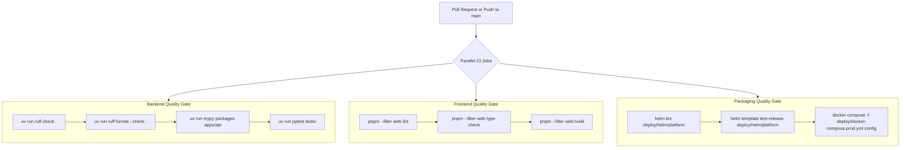

# CI/CD & Delivery Pipelines

Rocket Chat maintains an automated GitHub Actions release engineering pipeline documented in `.github/workflows/`.

---

## 1. Automated CI Pipeline (`.github/workflows/ci.yml`)

Runs on every Pull Request and merge to `main`. Every gate must pass before code can be merged:

---

## 2. Automated Release Pipeline (`.github/workflows/release.yml`)

Triggered on semantic version tags (e.g. `git tag v1.0.0 && git push origin v1.0.0`):

1. **Multi-Architecture Container Builds:**
   - Uses `docker/setup-qemu-action` and `docker/setup-buildx-action`.
   - Builds both `linux/amd64` (Intel/AMD cloud instances) and `linux/arm64` (Apple Silicon & AWS Graviton).
   - Publishes tagged images to GitHub Container Registry (`ghcr.io`).
2. **OCI Helm Chart Packaging:**
   - Packages Helm chart: `helm package deploy/helm/platform --version 1.0.0 --app-version 1.0.0`.
   - Pushes to GHCR as an OCI artifact: `helm push platform-1.0.0.tgz oci://ghcr.io/<org>/charts`.
3. **GitHub Release:**
   - Creates a formal GitHub Release with changelog notes.
   - Attaches `deploy/docker-compose.prod.yml` as a standalone release asset.
