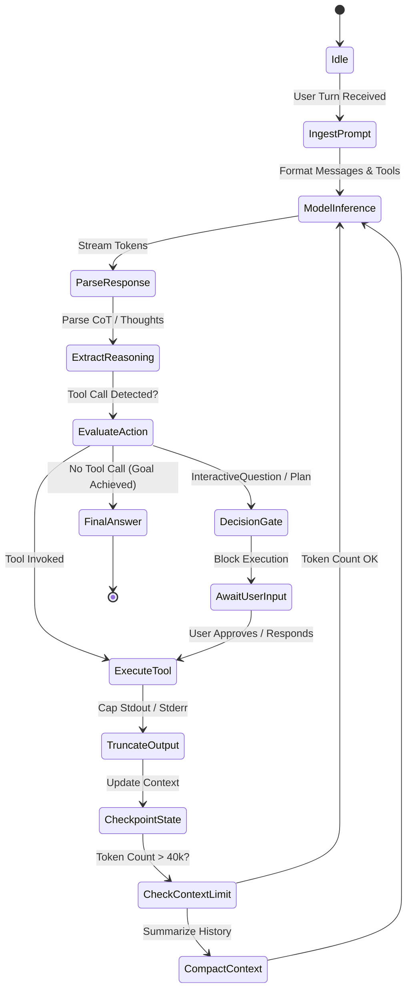

# Async ReAct Engine & Tools

The core intelligence of Rocket Chat resides in `packages/agent-core`. It implements an asynchronous **Reasoning + Acting (ReAct)** state machine engineered specifically for autonomous, high-precision software development.

---

## 1. The Autonomous ReAct State Machine

Unlike naive LLM wrappers that dump entire files into single-turn prompts, Rocket Chat orchestrates an explicit event-driven loop:

---

## 2. Multi-Provider Reasoning Extraction

Modern frontier models generate internal reasoning ("Chain of Thought") using different vendor schemas:
- **Anthropic Claude 3.7 Sonnet:** Uses `<thought>` or thinking blocks.
- **DeepSeek R1 / V3:** Emits structured `reasoning_content` delta payloads.
- **Google Gemini 2.0 Flash Thinking:** Delivers `thought: true` metadata chunks.
- **OpenAI o1 / o3-mini:** Emits internal reasoning tokens.

The `AsyncReActOrchestrator` normalizes all vendor-specific reasoning formats into uniform `AgentEvent(type="thought", content=...)` streams. This allows the frontend **Continuous Flight Stream** to render live, collapsible avionics telemetry while filtering raw internal thoughts from the final user response.

---

## 3. In-Stream Decision Gates

Autonomous agents fail when they make silent assumptions about ambiguous requirements. Rocket Chat incorporates **In-Stream Decision Gates** directly into the state machine:

### A. Interactive Questions (`InteractiveQuestion`)
When an agent encounters ambiguous requirements, missing environment keys, or architectural trade-offs, it invokes the `ask_question` tool:
- Execution yields and enters a `waiting_for_input` state.
- The UI renders an interactive modal with radio buttons, checkboxes, and write-in text boxes.
- Slack renders native Block Kit interactive action blocks.
- The turn only resumes when the human provides explicit input, preventing uncoordinated code alterations.

### B. Dynamic Plan Checklists (`PlanChecklist`)
Complex tasks generate structured plans consisting of distinct steps. The orchestrator tracks:
- Step completion status (`pending`, `in_progress`, `completed`, `failed`).
- Real-time phase indicators displayed in the Mission Control header.

---

## 4. Context Hygiene & 3-Tier Compaction Architecture

As an agent edits files, runs test suites, and reads logs, conversation history expands rapidly. To prevent context window exhaustion and prompt degradation while avoiding amnesia regarding original goals, the orchestrator enforces **Deterministic 3-Tier Context Hygiene**:

1. **Tier 1: Zero-Loss Deterministic Clamping (`clamp_output`):**
   - Commands emitting large stdout/stderr (e.g. `pytest`, `npm build`) and large file reads are clamped at `max_lines=400` or `max_bytes=25,000`.
   - Preserves the leading 80 lines (command initialization, build flags) and trailing 200 lines (stack traces, assertion failures, exit status) with a clean truncation marker.
2. **Tier 2: Tool-Payload Pruning (70% Threshold):**
   - When conversation tokens exceed 70% of the active model limit, verbose tool outputs older than the last 3 turns are converted into lightweight receipts:
     `"[Tool result ({lines} lines, {chars} chars) pruned to preserve active reasoning context]"`.
   - **Critical guarantee:** Assistant thoughts, CoT reasoning blocks, user prompts, and exact `tool_call_id` parity remain 100% intact.
3. **Tier 3: Invariant Anchor Compaction (85% Threshold):**
   - If conversation tokens reach 85% of capacity:
     - **Anchor 1:** System prompt.
     - **Anchor 2:** Initial user goal and instructions.
     - **Anchor 3:** Structured task checklist (`update_task_checklist`).
     - **Anchor 4:** The latest conversational turns.
     - Intermediate conversational filler is synthesized into a concise summary bridge.

## 5. Multi-Session Concurrency & Execution Context

Shared singleton registries must never mutate closure callbacks across concurrent user turns. Rocket Chat leverages standard Python `contextvars` (`current_execution_ctx`) to isolate:
- Active `session_id`
- Async event dispatch queues (`event_queue`)
- Parent model selection for delegated subagents

Tools and subagent delegations resolve context safely from the executing task's coroutine scope with zero cross-session bleed.

---

## 5. Line-Accurate Tool Suite

All agent tools adhere to strict software engineering standards to avoid destructive overwrites:

| Tool | Purpose | Safety Guarantees |
| :--- | :--- | :--- |
| `view_file` | Read local file contents | 1-indexed line slices, maximum 800 lines per turn, binary detection |
| `replace_file_content` | Precision code modification | Requires explicit `StartLine`, `EndLine`, and exact character matching of `TargetContent`. Prevents hallucinations and diff drift. |
| `write_to_file` | Create new files | Requires explicit `Overwrite: true` to prevent accidental clobbering |
| `run_command` | Execute shell commands | Timeout enforced, supports persistent terminals, background daemon tasks |
| `git_operation` | Safe git actions | Controlled branching, diff inspection, commit creation |
| `ask_question` | Human clarification | Halts agent loop until user selects options |
