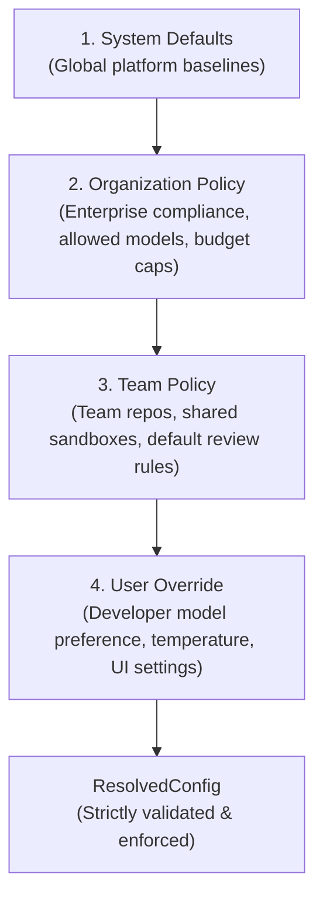

# Hierarchical Configuration & Policy Engine

The enterprise governance of Rocket Chat is driven by `packages/config-engine`. It evaluates a **4-tier hierarchical resolution cascade** that reconciles organization compliance mandates with developer personalization.

---

## 1. The 4-Tier Resolution Cascade

When an agent turn executes, configuration is dynamically compiled across four hierarchical tiers:



1. **System Defaults:** Built-in platform defaults (e.g. timeout 300s, standard resource limits).
2. **Organization Policy:** Enforced by enterprise IT/security administrators. Defines hard guardrails: allowed model providers, mandatory security scanners, resource quotas.
3. **Team Policy:** Department-level settings, such as engineering team conventions or shared sandbox limits.
4. **User Override:** Individual developer customizations (e.g., preferred coding model or personal prompt formatting).

---

## 2. Hard Constraint Enforcement (`PolicyViolationError`)

A critical enterprise guarantee is that **lower tiers cannot override hard security constraints imposed by higher tiers**:

- **Model Whitelisting:** If an Organization Policy declares:
  ```json
  { "allowed_models": ["anthropic/*", "openrouter/anthropic/*"] }
  ```
  And a developer attempts to select `openai/gpt-4o` in their User Override, the Config Engine halts execution immediately by raising a `PolicyViolationError`:
  ```text
  PolicyViolationError: Model 'openai/gpt-4o' violates Organization 'org-corp' allowed model policy.
  ```
- **Resource Capping:** If an Org Policy limits sandbox memory to `2Gi`, a Team or User attempting to request `8Gi` is strictly clamped or rejected.
- **Network Egress Policies:** An Organization can mandate that agent sandboxes operate with restricted network egress, blocking all non-whitelisted destinations.

---

## 3. Dynamic Injection into Control Plane Runtimes

Once resolved into a `ResolvedConfig` object:
1. **LiteLLM Gateway:** Injects the appropriate decrypted BYOK API key and target model parameters.
2. **Sandbox Drivers (Docker / K8s):** Injects CPU, memory, and timeout `ResourceLimits` into the Pod or container manifest.
3. **ReAct Orchestrator:** Configures context compaction thresholds and maximum turn iterations.
