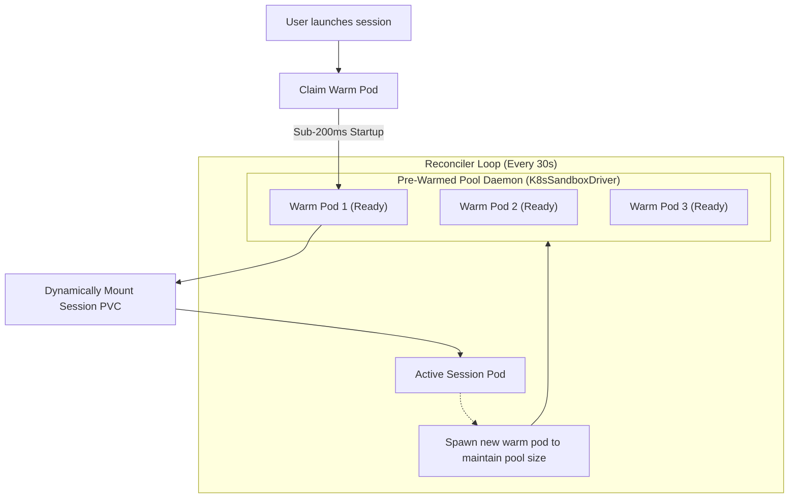

# Custom Sandbox Images, Warm Pools & Lifecycle Management

Execution sandboxes in Rocket Chat are fully customizable to meet the toolchain and compiler requirements of diverse software projects, ranging from Python microservices and Rust libraries to polyglot monorepos and Terraform infrastructures.

---

## 1. Custom Sandbox Images

While the default sandbox image is `python:3.12-slim`, software development often requires specialized toolchains (e.g. GCC/Clang, JDK 21, Rust `cargo`, Go, Node.js, Docker CLI).

### A. Sandbox Image Requirements
A custom sandbox image must satisfy minimal runtime prerequisites:
1. **Linux OS:** Debian, Ubuntu, Alpine, or Wolfi-based.
2. **Shell:** Standard `bash` or `sh` located at `/bin/bash` or `/bin/sh`.
3. **Core Utilities:** `git`, `coreutils` (for line slicing and file manipulation), and `ca-certificates`.
4. **Working Directory:** Configured with write access to `/workspace`.

### Example Dockerfile: Polyglot Engineering Sandbox
```dockerfile
FROM ubuntu:24.04

# Prevent interactive prompts
ENV DEBIAN_FRONTEND=noninteractive

# Install essential dev utilities, Git, Python 3.12, Node 22, Rust, and Go
RUN apt-get update && apt-get install -y --no-install-recommends \
    bash \
    curl \
    git \
    build-essential \
    ca-certificates \
    python3 \
    python3-pip \
    golang-go \
    nodejs \
    npm \
    && rm -rf /var/lib/apt/lists/*

# Install Rust toolchain
RUN curl --proto '=https' --tlsv1.2 -sSf https://sh.rustup.rs | sh -s -- -y
ENV PATH="/root/.cargo/bin:$PATH"

WORKDIR /workspace
CMD ["/bin/bash"]
```

### B. Configuring Custom Images
Custom images can be specified across multiple hierarchy levels:
- **Organization Fleet Defaults (`/settings/org/sandboxes`):** Configure the fleet default container image (default: `python:3.12-slim`), CPU cores, memory limits, and whitelisted image registry pools in the Organization Console.
- **Custom Agent Personas (`/settings/agents`):** Customize the container image (e.g. `python:3.12-slim`, `node:20-slim`, `rust:1.77-slim`), CPU/RAM constraints, sampling temperature, thinking token budget, and reasoning effort on a per-agent basis.
- **Per Session (REST / UI):** Set `container_image: "my-registry.io/dev-sandbox:v2"` in `POST /v1/sessions` or the Mission Control cockpit.
- **Per Developer:** Configured in `UserOverride.preferred_image`.
- **Per Team:** Configured in `TeamPolicy.default_image`.
- **Per Organization:** Configured in `OrgPolicy.default_image`.

### C. Enterprise Governance: Whitelisting (`allowed_images`)
To prevent developers from running unvetted or untrusted container images, an enterprise organization can enforce an image whitelist in `OrgPolicy`:

```json
{
  "allowed_images": [
    "internal-registry.company.com/sandboxes/*",
    "python:3.12-slim",
    "golang:1.23-alpine"
  ]
}
```
If a developer requests an image outside the whitelist, the Config Engine immediately rejects the session by raising a `PolicyViolationError`.

### D. Private Image Pull Secrets in Kubernetes
When pulling custom sandbox images from private registries (AWS ECR, GCP Artifact Registry, Azure ACR, GitHub Container Registry), specify secret names via `K8S_IMAGE_PULL_SECRETS`:

```bash
K8S_IMAGE_PULL_SECRETS="company-registry-secret,ecr-pull-token"
```

---

## 2. Sandbox Pre-Warmed Pools

Starting a fresh Kubernetes Pod from scratch typically incurs a **5 to 15-second delay** (node scheduling, container image pulling, CNI network attachment, volume mounting).

To deliver instantaneous interaction, Rocket Chat implements an optional **Pre-Warmed Pod Pool**:



### Configuration
In your environment or Helm values:
```bash
# Maintain 3 warm pods in the sandbox namespace
K8S_WARMED_POOL_SIZE=3
K8S_WARMED_IMAGE="python:3.12-slim"
```

When a new session is created:
1. The driver immediately claims an idle warm pod from the pool.
2. The turn begins executing commands in **`< 200ms`**.
3. The background reconciler (`reconcile_warm_pool`) automatically launches a replacement warm pod in the background to maintain the configured pool size.

---

## 3. Inactivity Lifecycle: Pausing vs. Cleanup

To minimize cloud computing and storage costs, Rocket Chat enforces a two-stage inactivity lifecycle:

```
[Active Turn Execution]
         |
         | (300 seconds of inactivity)
         v
[Stage 1: Inactivity Pause (Scale-to-Zero Hibernation)]
- Pod is deleted: 0 CPU and 0 RAM consumed
- PVC remains bound: Git repo and modified files preserved
- Soft node affinity records nodeName for fast resumption (< 1.5s)
         |
         | (3,600 seconds of total inactivity)
         v
[Stage 2: Inactivity Cleanup (Complete Deletion)]
- Pod is terminated (if running)
- PersistentVolumeClaim is deleted
- Storage capacity returned to cloud provider
```

### Configuration Parameters

| Parameter | Environment Variable | Default | Action Taken |
| :--- | :--- | :--- | :--- |
| **Inactivity Pause** | `SANDBOX_INACTIVITY_PAUSE_SECONDS` | `300` (5 min) | Deletes ephemeral pod; retains PVC. |
| **Inactivity Cleanup** | `SANDBOX_INACTIVITY_CLEANUP_SECONDS` | `3600` (1 hr) | Deletes pod, PVC, and session volume. |

The control plane runs a background reconciliation loop every 30 seconds (`reconcile_inactivity`), inspecting timestamps on all active sessions and safely executing pause and cleanup transitions.
