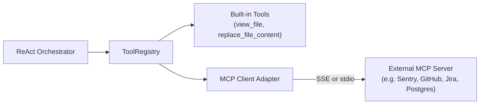

# Extensibility & Custom Tools Guide

Rocket Chat is designed as an open, modular platform. Developers can extend the platform by adding custom agent tools, connecting Model Context Protocol (MCP) servers, integrating custom sandbox drivers, and adding specialized LLM routing logic.

---

## 1. Writing Custom Agent Tools

All tools invoked by the ReAct orchestrator are managed by `ToolRegistry` (`packages/agent-core`).

### Step-by-Step: Creating a Custom Static Analysis Tool

Let's build a tool that runs `semgrep` or `bandit` inside the sandbox:

```python
from typing import Any
from agent_core.tools.registry import ToolRegistry
from specifications.interfaces.sandbox import SandboxDriverProtocol

class SecurityScanTool:
    """Runs a static application security testing (SAST) scan in the active sandbox."""

    def __init__(self, driver: SandboxDriverProtocol) -> None:
        self.driver = driver

    @property
    def declaration(self) -> dict[str, Any]:
        """Tool definition conforming to standard OpenAI / LiteLLM function calling schemas."""
        return {
            "name": "run_security_scan",
            "description": "Scans workspace source code for security vulnerabilities, secrets, and OWASP issues.",
            "parameters": {
                "type": "object",
                "properties": {
                    "severity": {
                        "type": "string",
                        "enum": ["low", "medium", "high", "error"],
                        "description": "Minimum severity threshold to report.",
                        "default": "medium",
                    },
                    "path": {
                        "type": "string",
                        "description": "Relative directory or file path to scan.",
                        "default": ".",
                    },
                },
                "required": ["severity"],
            },
        }

    async def execute(self, session_id: str, severity: str = "medium", path: str = ".") -> str:
        """Executes the security scan inside the session sandbox."""
        cmd = f"bandit -r {path} -lll --format custom"
        result = await self.driver.execute_command(session_id, cmd, timeout=120)
        if result.exit_code == 0:
            return "Security scan passed: Zero high/medium vulnerabilities detected."
        return f"Vulnerabilities detected (Exit {result.exit_code}):\n{result.stdout}\n{result.stderr}"
```

### Registering the Tool
Register the tool in `apps/api/src/api/main.py`:

```python
tool = SecurityScanTool(driver=sandbox_driver)
tool_registry.register_tool(name="run_security_scan", tool=tool)
```

The tool immediately becomes available to the ReAct agent across all sessions.

---

## 2. Model Context Protocol (FastMCP) Integration

Rocket Chat supports the official **Model Context Protocol (MCP)** specification:



### Exposing Tools via MCP
To expose internal sandbox tools to external clients via FastMCP:
```python
from mcp.server.fastmcp import FastMCP

mcp = FastMCP("RocketChat-Tools")

@mcp.tool()
async def read_workspace_file(session_id: str, path: str) -> str:
    """Read file content from the active sandbox workspace."""
    return await sandbox_driver.read_file(session_id, path)
```

---

## 3. Implementing Custom Sandbox Drivers

To run agent sessions inside custom runtimes (e.g. AWS Firecracker microVMs, gVisor `runsc`, Kata Containers, or local Podman), implement `SandboxDriverProtocol`:

```python
from specifications.interfaces.sandbox import SandboxDriverProtocol, WorkspaceSpec, SandboxStatus, ExecResult

class FirecrackerMicroVMDriver(SandboxDriverProtocol):
    """Custom sandbox driver spinning up ephemeral Firecracker microVMs."""

    async def create_sandbox(self, spec: WorkspaceSpec) -> SandboxStatus:
        # 1. Allocate block device / snapshot
        # 2. Launch Firecracker jailer process with spec.limits
        # 3. Return active status
        ...

    async def execute_command(self, session_id: str, cmd: str, timeout: int = 60) -> ExecResult:
        # Execute command inside microVM via SSH or vsock
        ...
```

Register your driver in `apps/api/src/api/main.py` when `DEFAULT_SANDBOX_DRIVER="firecracker"`.

---

## 4. Advanced Multi-Scheme MCP & Write-Only Secret Vault

Rocket Chat supports connecting enterprise MCP servers across three distinct transport schemes:
1. **HTTP**: Standard REST and JSON-RPC over HTTPS.
2. **SSE (Server-Sent Events)**: Streaming transport for real-time remote tools.
3. **stdio**: Container subprocess execution via pipes.

### Write-Only Secret Storage Guarantees
Credentials provided during MCP registration (API keys, OAuth client secrets, sensitive custom headers) are encrypted at rest using `AES-256-GCM` via `CredentialCipher`:
- **Never returned in API responses**: Only safe fingerprints (e.g., `sk-...9f2c`) and boolean flags (`has_api_key: true`) are exposed to the UI and clients.
- **In-memory decryption only**: Secrets are decrypted strictly during tool invocation dispatches and scrubbed from error logs.

### Prompt Guidance Injection
Each registered MCP server can specify custom guidance rules. These hints are dynamically composed and injected into the ReAct system prompt, instructing the model on exact scenarios and arguments to use.

---

## 5. Autonomous Specialist Subagents

For complex missions requiring division of labor without session fragmentation, Rocket Chat provides single-session specialist subagents (`security_auditor`, `qa_verifier`, `researcher`):
- **Single-Session Sandbox Sharing**: Subagents execute inside the same active container and workspace, returning synthesized reports directly to the lead agent.
- **Turn Limits & Resource Safeguards**: Each specialist has a configurable turn limit cap (default: 4 turns) and sampling temperature.
- **Strict Anti-Recursion Protection**: Subagents have delegation tools stripped from their allowed tools list to eliminate runaway delegation cycles.

---

## 6. Parallel Multi-Tool Execution & File Mutation Locking

When models emit multiple tool calls in a single turn, the orchestrator executes them concurrently via `asyncio.gather`:
- **Read Parallelism**: Read-only tools (`file_read`, `web_search`, `web_fetch`) run fully in parallel.
- **Per-Path File Write Locks**: To prevent race conditions and patch collisions, mutating tools (`file_write`, `file_edit`, `apply_patch`) acquire an asynchronous per-path lock (`self._file_locks[path]`). Writes targeting different paths execute simultaneously, while writes to the identical file are cleanly serialized.

