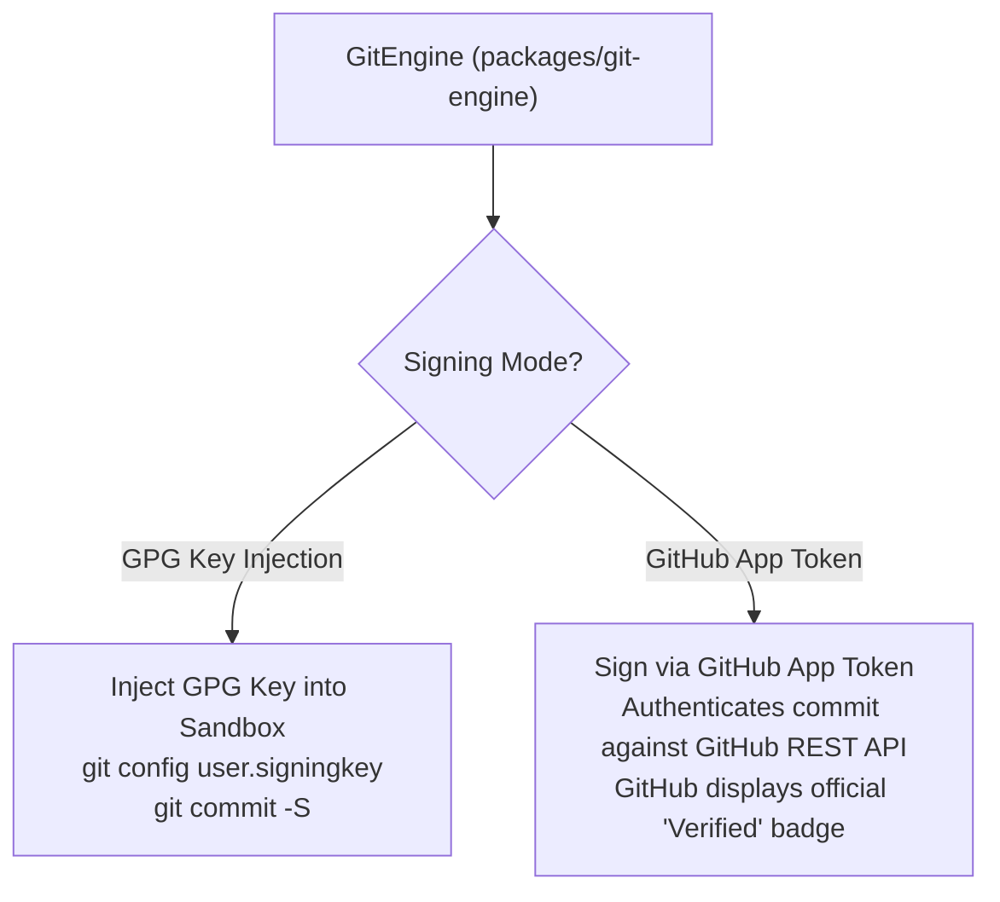

# Git Engine & GitHub App Webhook Ingress

Autonomous AI commits must integrate cleanly into corporate version control workflows. `packages/git-engine` and `apps/api/routers/webhooks.py` provide cryptographic attestation, automated co-authorship attribution, and event-driven session resumption.

---

## 1. Automated Git Co-Authorship Trailers

Whenever Rocket Chat generates a git commit, it automatically structures the commit message according to Git and GitHub co-authorship standards:

```text
fix(auth): resolve race condition in token expiration check

Mitigate thread deadlock by acquiring an asyncio lock before refreshing expired OAuth tokens.

Co-authored-by: Alice Engineer <alice@company.com>
Co-authored-by: Rocket Chat Agent <agent@rocket-chat.internal>
```

The Git Engine inspects the session user identity and active team context, appending standard `Co-authored-by:` trailers so human engineers and AI contributions are accurately credited in git log graphs and GitHub PR attribution views.

---

## 2. Cryptographic Commit Signing (Verified Badge)

Unsigned AI commits are a major supply chain security vulnerability. Rocket Chat supports two cryptographic signing modes:



1. **GPG Key Signing:** Injects a tenant or organization GPG private key into the sandbox environment, executing `git commit -S` with commit signature verification.
2. **GitHub App Installation Token:** Creates commits via the GitHub App REST API using an installation token. Commits automatically receive GitHub's green **Verified** status badge.

---

## 3. GitHub App Webhook Ingress & Session Resume

Rocket Chat provides bi-directional GitHub integration via secure webhooks:

### A. HMAC SHA-256 Signature Verification
Every inbound webhook request to `/v1/webhooks/github` is verified using standard HMAC SHA-256 signatures:
```python
# Verify X-Hub-Signature-256 header matches payload HMAC with GITHUB_WEBHOOK_SECRET
mac = hmac.new(webhook_secret.encode(), msg=raw_payload, digestmod=hashlib.sha256)
expected_signature = f"sha256={mac.hexdigest()}"
if not hmac.compare_digest(expected_signature, request_signature):
    raise HTTPException(status_code=401, detail="Invalid HMAC signature")
```

### B. Event Triggers
1. **`issues.labeled` (`ai-fix`):**
   - Triggered when a developer adds the label `ai-fix` to any issue.
   - Spawns a sandbox, clones the repository, checks out a branch `rocket/fix-issue-<number>`, and prompts the ReAct agent with the issue title and body.
2. **`issue_comment.created` (Automated Session Resume):**
   - Triggered when a developer comments on an existing issue or pull request managed by Rocket Chat.
   - **Automated Resume Sequence:**
     1. Wakes up the hibernated sandbox pod/container.
     2. Mounts the persistent volume retaining the repository state.
     3. Runs `git pull` to fetch any changes pushed by human engineers.
     4. Appends the new comment to the agent's conversation history.
     5. Resumes the autonomous loop to address the feedback.

---

## 4. 100% Optional GitHub Integration

Rocket Chat does not hard-code GitHub dependencies. If GitHub credentials are not configured, the platform operates seamlessly on local git repositories, raw directories, or scratchpads.
