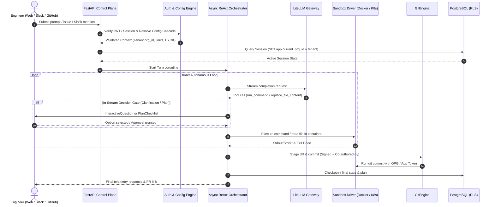

# Architecture Overview

Rocket Chat is engineered around a single foundational philosophy: **Software Craftsmanship and Operational Simplicity over Microservice Sprawl**.

---

## 1. The Modular Two-Tier Architecture

Many modern AI agent frameworks fracture their systems across half a dozen microservices: an auth proxy, a WebSocket gateway, a task worker queue (e.g. Celery/Temporal), an LLM router, a Slack webhook listener, and a container agent daemon. This creates high operational drag, network serialization overhead, non-deterministic race conditions, and complex deployment topologies.

Rocket Chat replaces microservice fragmentation with a **modular two-tier system backed by a single multi-model database**:

```
+-----------------------------------------------------------------------------+
|                          CLIENT / FRONTEND TIER                             |
|                                                                             |
|  Next.js 15 (App Router) + TypeScript                                       |
|  - Tailwind CSS + shadcn/ui                                                 |
|  - Monaco DiffEditor (Read-only Side-by-Side Diffs)                         |
|  - @xterm/xterm (Read-only ANSI Execution Logs)                             |
|  - Zustand (Client State) + Native WebSockets                               |
+--------------------------------------|--------------------------------------+
                                       | HTTP REST & WebSockets
+--------------------------------------v--------------------------------------+
|                     UNIFIED BACKEND CONTROL PLANE                           |
|                                                                             |
|  FastAPI (Python 3.12+) managed with uv                                     |
|                                                                             |
|  [Embedded Modules in Single Process]:                                      |
|  1. API Gateway & Auth Engine (FastAPI + Pydantic v2)                       |
|  2. Async Agent ReAct State Machine (asyncio)                               |
|  3. LLM & BYOK Router (LiteLLM)                                             |
|  4. Tool Server & Sandboxes (Docker SDK / kubernetes_asyncio)                |
|  5. Native Slack Assistant (slack-bolt Async Socket Mode task)              |
|  6. Git & GitHub App Engine (Signed commits & Webhook ingress)              |
+--------------------------------------|--------------------------------------+
                                       |
+--------------------------------------v--------------------------------------+
|                         PERSISTENCE & STORAGE                               |
|                                                                             |
|  PostgreSQL 16 (+ pgvector)                                                 |
|  - Kernel Row-Level Security (RLS) for tenant isolation                     |
|  - JSONB documents for session conversation trees and checkpoints           |
|  - Vector embeddings for semantic search and documentation RAG              |
+-----------------------------------------------------------------------------+
```

---

## 2. In-Process Async Concurrency

Because the backend control plane is written with Python 3.12 `asyncio` and ASGI (FastAPI / Uvicorn), high-concurrency tasks run seamlessly inside a single process:

1. **Embedded Slack Assistant:** The Slack Bolt app runs in the background as an `asyncio.create_task`, holding persistent outbound WebSocket connections via Socket Mode.
2. **ReAct State Machine:** Agent execution loops are non-blocking coroutines that await LLM streaming tokens, tool execution chunks, and user decision inputs.
3. **Background Reconciler:** A lightweight background task reconciles idle sandboxes, executes scale-to-zero hibernation, and maintains warm pool containers.

---

## 3. Data Flow & Request Lifecycles



---

## 4. Subsystem Catalog

Each component in Rocket Chat is built against strict, polymorphic interfaces defined in `specifications/interfaces/`:

| Subsystem | Package / App | Protocol Contract | Purpose |
| :--- | :--- | :--- | :--- |
| **Agent Core** | `packages/agent-core` | `AgentOrchestratorProtocol` | Async ReAct state machine, AST tools, decision gates |
| **Sandbox Driver** | `packages/sandbox-driver` | `SandboxDriverProtocol` | Polymorphic container execution (Docker local / K8s cluster) |
| **LLM Gateway** | `packages/llm-gateway` | `LLMGatewayProtocol` | LiteLLM routing, streaming, hardware AES-256-GCM cipher |
| **Config Engine** | `packages/config-engine` | `ConfigEngineProtocol` | 4-tier policy resolution, constraint checks |
| **Git Engine** | `packages/git-engine` | `GitEngineProtocol` | Standard co-authors, cryptographic signing, GitHub webhook resume |
| **Slack Assistant** | `packages/slack-assistant` | N/A (Bolt Async) | Zero-ingress Slack bot with thread spinners and modal gates |
| **FastAPI API** | `apps/api` | REST / WebSocket API | Session management, OIDC middleware, event bus |
| **Mission Control** | `apps/web` | Next.js 15 App Router | Cosmic Telemetry UI, Monaco DiffEditor, xterm logs |
