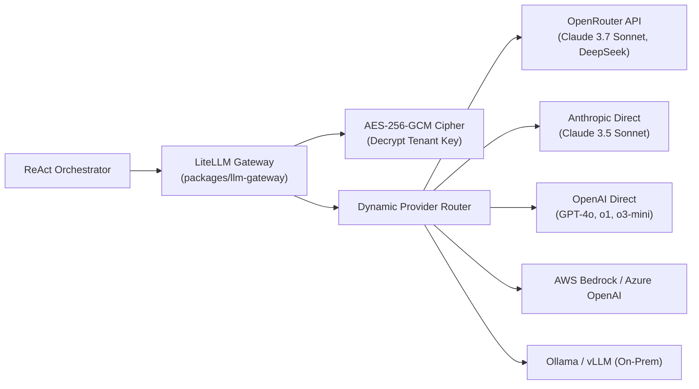

# LiteLLM Gateway & BYOK Encryption

The LLM abstraction layer in `packages/llm-gateway` decouples the agent orchestration loop from individual AI providers while providing enterprise-grade **Bring-Your-Own-Key (BYOK)** encryption.

---

## 1. Universal Model Routing with LiteLLM

Rather than maintaining custom HTTP client code for every model vendor, Rocket Chat standardizes on **LiteLLM**:



### Supported Providers & Models
- **Frontier Coding Models:** `openrouter/anthropic/claude-3.7-sonnet`, `anthropic/claude-3-5-sonnet-20241022`, `openai/gpt-4o`.
- **Reasoning Models:** `deepseek/deepseek-r1`, `openai/o1`, `openai/o3-mini`.
- **Self-Hosted / Air-Gapped:** `ollama/qwen2.5-coder:32b`, `vllm/meta-llama/Llama-3.1-70B-Instruct`.

---

## 2. Hardware-Grade AES-256-GCM BYOK Encryption

Enterprise organizations frequently bring their own API keys to ensure data sovereignty and manage direct commercial agreements with model vendors. Rocket Chat enforces hardware-grade **AES-256-GCM** encryption at rest in `CredentialCipher`:

### Cryptographic Specification

| Parameter | Value | Rationale |
| :--- | :--- | :--- |
| **Cipher Algorithm** | AES-256 in Galois/Counter Mode (GCM) | Provides authenticated encryption (AEAD); ciphertext cannot be tampered with. |
| **Key Derivation** | PBKDF2 HMAC-SHA256 | Derives a 256-bit cryptographic key from the master secret (`ENCRYPTION_MASTER_KEY`). |
| **KDF Iterations** | 100,000 rounds | Mitigates brute-force key recovery attacks. |
| **Salt** | 16 bytes (cryptographically random) | Unique per ciphertext; eliminates rainbow table attacks. |
| **IV (Nonce)** | 12 bytes (96 bits) | Cryptographically random per encryption operation, as recommended by NIST SP 800-38D. |
| **Authentication Tag** | 16 bytes (128 bits) | Verifies ciphertext integrity before decryption. |

### Cipher Payload Format
Encrypted BYOK records stored in the database follow a binary-packed structure:
```text
+-------------------+------------------+-------------------+--------------------+
|  SALT (16 bytes)  |   IV (12 bytes)  |  TAG (16 bytes)   | CIPHERTEXT (var)   |
+-------------------+------------------+-------------------+--------------------+
```
Any modification to the stored ciphertext or tag causes decryption to raise an authentication error, preventing tampered credential injection.

---

## 3. Dynamic Model Routing & Fallbacks

The gateway supports dynamic fallback cascades:
- If a primary vendor (e.g. Anthropic direct) experiences an outage (`503 Service Unavailable` or rate limit `429`), the request automatically fails over to a secondary provider (e.g. OpenRouter or AWS Bedrock) with zero interrupted agent turns.
- Real-time token usage and cost accounting are captured for every request.

---

## 4. Real-Time Token & Credit Usage Ledger

Rocket Chat tracks granular prompt and completion token metrics at both the organization and individual user levels:
- **Ledger Ingestion:** During agent orchestration (`_stream_model_step` and subagent executions), completion token usage reported by upstream providers is captured immediately or accurately estimated.
- **Cost Calculation:** Token metrics are converted to real-time USD costs based on LiteLLM provider rate cards.
- **Budget Enforcements:** Organizations can set monthly budget caps via `set_budget_cap(tenant_org_id, cap)` to prevent cost overruns.
- **Telemetry Endpoints:** Live telemetry is exposed to the Mission Control Cockpit through `GET /v1/settings/org/usage` and `GET /v1/settings/user/usage`.
