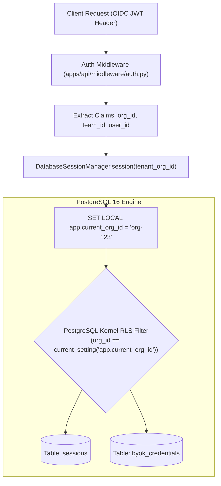

# Multi-Tenancy & PostgreSQL Row-Level Security (RLS)

In enterprise AI software, multi-tenancy cannot rely on application-level filtering (`WHERE org_id = :org_id`). A single developer oversight, un-scoped join, or third-party ORM query bug can leak proprietary source code, conversation histories, or API keys across tenant boundaries.

Rocket Chat guarantees absolute tenant isolation by pushing enforcement down to the database engine via **PostgreSQL Row-Level Security (RLS)**.

---

## 1. Kernel-Enforced Isolation Architecture



---

## 2. Superuser vs. Application User (`rocket_app`)

By design in PostgreSQL, **superusers (`postgres`) bypass Row-Level Security**. If an application connects to PostgreSQL as a superuser, RLS policies are completely ignored.

To guarantee enforcement:
1. **Migrations (Admin Connection):** Alembic migrations connect via `ADMIN_DATABASE_URL` (as `postgres`) to create tables, alter DDL, and establish RLS policies.
2. **Application (Runtime Connection):** The control plane connects via `DATABASE_URL` as a dedicated non-superuser: **`rocket_app`**.
3. **Forced RLS:** All tenant tables enforce `FORCE ROW LEVEL SECURITY`, preventing bypass even if table owners run queries.

```sql
-- PostgreSQL RLS Policy on sessions
ALTER TABLE sessions ENABLE ROW LEVEL SECURITY;
ALTER TABLE sessions FORCE ROW LEVEL SECURITY;

CREATE POLICY tenant_isolation_sessions ON sessions
    FOR ALL
    USING (org_id = current_setting('app.current_org_id', true));

-- PostgreSQL RLS Policy on BYOK credentials
ALTER TABLE byok_credentials ENABLE ROW LEVEL SECURITY;
ALTER TABLE byok_credentials FORCE ROW LEVEL SECURITY;

CREATE POLICY tenant_isolation_byok ON byok_credentials
    FOR ALL
    USING (org_id = current_setting('app.current_org_id', true));
```

---

## 3. Transaction-Local Tenant Injection

PostgreSQL does not permit parameterized bindings in raw `SET LOCAL` statements. Rocket Chat uses `SELECT set_config(...)` with `is_local = true`:

```python
async def set_tenant_context(session: AsyncSession, org_id: str) -> None:
    """Set the PostgreSQL transaction-local tenant context to enforce Row-Level Security."""
    if session.bind and session.bind.dialect.name == "postgresql":
        # 'SELECT set_config(setting_name, new_value, is_local)' supports parameterized bindings
        # and is_local=true binds strictly to the current transaction.
        await session.execute(
            text("SELECT set_config('app.current_org_id', :org_id, true)"),
            {"org_id": org_id},
        )
    session.info["tenant_org_id"] = org_id
```

When the transaction commits or rolls back, PostgreSQL automatically clears `app.current_org_id`, completely eliminating cross-transaction connection pool pollution.

---

## 4. OIDC & SSO JWT Verification Middleware

The authentication middleware in `apps/api/src/api/middleware/auth.py` protects all API and WebSocket routes:

- **Algorithm Support:** Verifies `RS256` signatures against corporate identity providers (Okta, Azure AD, Auth0, Keycloak) using JSON Web Key Sets (JWKS).
- **Claim Extraction:** Extracts:
  - `org_id` (Tenant Organization ID)
  - `team_id` (Team identifier)
  - `user_id` / `sub` (User identity)
- **Context Injection:** Injects verified tenant claims into `request.state` and automatically propagates them to `DatabaseSessionManager`.
