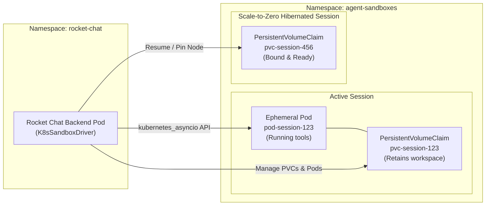

# Dual Sandbox Engine (Docker & Kubernetes)

Security and reproducibility in AI pair-programming require strict isolation. Rocket Chat implements a polymorphic dual-driver architecture conforming to the `SandboxDriverProtocol` defined in `specifications/interfaces/sandbox.py`.

Whether running locally on macOS or in an enterprise multi-tenant Kubernetes cluster, the ReAct agent code interacts with sandboxes using the exact same interface.

---

## 1. Architectural Contract: `SandboxDriverProtocol`

Every driver implements the following polymorphic contract:

```python
class SandboxDriverProtocol(Protocol):
    async def create_sandbox(self, spec: WorkspaceSpec) -> SandboxStatus: ...
    async def start_sandbox(self, session_id: str) -> None: ...
    async def stop_sandbox(self, session_id: str) -> None: ...
    async def delete_sandbox(self, session_id: str) -> None: ...
    async def execute_command(self, session_id: str, cmd: str, timeout: int = 60) -> ExecResult: ...
    async def stream_command(self, session_id: str, cmd: str) -> AsyncIterator[str]: ...
    async def read_file(self, session_id: str, path: str) -> str: ...
    async def write_file(self, session_id: str, path: str, content: str) -> None: ...
```

---

## 2. Local Docker Sandbox Driver (`DockerSandboxDriver`)

Used for local development, CI testing, and lightweight single-node deployments:

1. **Named Volume Persistence:** Each session is assigned a persistent Docker volume (`vol-session-<id>`) mounted at `/workspace`. Git history and file changes survive container hibernation.
2. **Warm Container Pools:** Pre-warms idle containers in the background to achieve `< 200ms` turn startup.
3. **Inactivity Reaping:** Background daemon detects idle sessions past a configured timeout, stops the container, and prunes unused volumes.

---

## 3. Production Kubernetes Sandbox Driver (`K8sSandboxDriver`)

In production, agents run as ephemeral Kubernetes Pods inside an isolated `agent-sandboxes` namespace.



### A. Dynamic Storage Class Integration
Cloud storage classes are injected directly into PVC creation manifests:
- **AWS EKS:** `gp3` (EBS CSI driver)
- **Azure AKS:** `managed-csi` (Azure Disk)
- **GCP GKE:** `pd-balanced` (Google Compute Persistent Disk)
- **On-Prem / Local:** `standard` or `local-path`

### B. Scale-to-Zero Hibernation
When a session is idle, the Pod is deleted (`scale-to-zero`), releasing CPU and memory resources back to the Kubernetes cluster. The underlying PersistentVolumeClaim remains bound and intact.

### C. Soft Node-Affinity Pinning (< 3s Resume Latency)
When an agent is woken up by a user message, cloud block storage (AWS EBS / Azure Disk) typically requires **60 to 90 seconds** to detach from the old node and reattach to a new node.

To eliminate this latency, Rocket Chat records the `nodeName` where the pod was originally scheduled. Upon resumption, it applies **Soft Node Affinity**:

```yaml
affinity:
  nodeAffinity:
    preferredDuringSchedulingIgnoredDuringExecution:
      - weight: 100
        preference:
          matchExpressions:
            - key: kubernetes.io/hostname
              operator: In
              values:
                - "ip-10-0-12-34.ec2.internal"
```

#### Why Soft Affinity Instead of Hard `nodeSelector`?
- **Hard `nodeSelector` Failure Mode:** If the previous node is cordoned for maintenance, running cluster upgrades, or scaled down by the autoscaler, a hard `nodeSelector` causes the pod to stay in `Pending` state indefinitely, failing the session.
- **Soft Affinity Resilience:** Kubernetes attempts to place the resumed pod on the previous node where the volume is already attached, resuming execution in **`< 1.5 seconds`**. If that node is unavailable or tainted, the Kubernetes scheduler gracefully falls back to dynamic rescheduling on another node.

### D. Safe Pod Eviction & Node Drain Management
Agent sandbox pods are marked with annotations to ensure they do not block node drains or autoscaler downscaling when idle:
- Active execution runs with termination protection.
- Hibernated sessions hold zero running pods, completely unblocking node pool maintenance.
