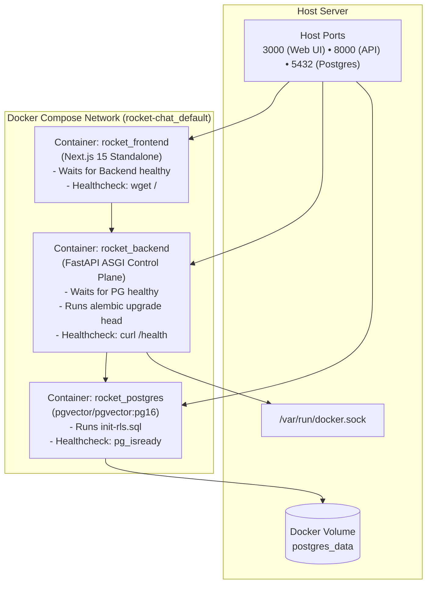

# Production Docker Compose

For single-node servers, internal departmental tools, and staging instances, Rocket Chat provides a complete, turnkey Docker Compose deployment in `deploy/docker-compose.prod.yml`.

---

## 1. Stack Topology

The compose stack spins up three healthy, interconnected containers:



---

## 2. Launching the Production Stack

```bash
# 1. Download or locate compose file
cd rocket-chat

# 2. Start stack in background
docker compose -f deploy/docker-compose.prod.yml up -d
```

### Health Check Verification
```bash
docker compose -f deploy/docker-compose.prod.yml ps
```
All services (`rocket_postgres`, `rocket_backend`, `rocket_frontend`) must report healthy status.

---

## 3. Automated Database Initialization & Migrations

1. **RLS User Provisioning (`init-rls.sql`):** The Postgres container executes `init-rls.sql` on startup, creating the non-superuser `rocket_app` role and granting necessary permissions.
2. **Schema Migration Entrypoint (`entrypoint.backend.sh`):** When the backend starts, its entrypoint executes `alembic upgrade head`, ensuring all tables, indexes, and Row-Level Security policies are applied before traffic starts serving.

---

## 4. Docker Sandbox Integration

The backend container mounts `/var/run/docker.sock`:
```yaml
volumes:
  - /var/run/docker.sock:/var/run/docker.sock
```
This enables `DockerSandboxDriver` inside the container to dynamically spin up sibling sandbox containers on the host Docker daemon.
