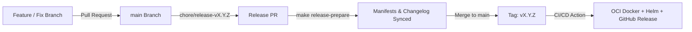

# Public Release Readiness

What is required to ship a publicly usable version using public container images and the Helm chart.

## Blockers (must fix)

| Area | Requirement |
|------|-------------|
| Auth | Enforce OIDC on all routes **including WebSocket**; remove the header-based identity fallback outside dev |
| Authorization | Restrict `POST /v1/agents` and org-wide actions to `admin`; per-org personas |
| Persistence | Wire `PostgresSessionStore` in `main.py` (currently `InMemorySessionStore`); run migrations (Alembic) at startup/Helm hook |
| Secrets | BYOK encryption key and OIDC/DB credentials via Kubernetes Secrets / external secret store, never in `values.yaml` |
| Sandbox isolation | Docker driver mounts the host socket: unsuitable for multi-tenant public hosting. Use the K8s driver with NetworkPolicy, non-root, resource limits, gVisor/Kata if untrusted code |
| Rate limiting | Per-user limits on turns, tool execution and model spend |
| CORS | Set `CORS_ALLOW_ORIGINS` to the public web origin |

## Release Engineering & Git Flow

Rocket Chat uses a **Trunk-Based Release Flow** tailored for unified monorepo deployments:

1. **Trunk Convergence**: Feature branches branch from and merge back into `main` using squash or rebase merges to maintain a clean, linear git history.
2. **Release Preparation**: Maintainers run `make release-prepare VERSION=X.Y.Z` on a release branch, which:
   - Promotes `[Unreleased]` notes in `CHANGELOG.md` to `[X.Y.Z]`.
   - Synchronizes versions across root `package.json`, `apps/web/package.json`, and `deploy/helm/platform/Chart.yaml`.
3. **Automated Publishing**: Pushing tag `vX.Y.Z` triggers `.github/workflows/release.yml`, extracting release notes via `scripts/release.py notes` and pushing multi-platform images and Helm packages.

## Packaging & Distribution

1. **Multi-Arch OCI Images (GHCR)**:
   - Backend: `ghcr.io/rocket-chat/backend:latest` and `:v<semver>` (built for `linux/amd64` and `linux/arm64`).
   - Frontend: `ghcr.io/rocket-chat/frontend:latest` and `:v<semver>` (built for `linux/amd64` and `linux/arm64`).
   - Automated via `.github/workflows/release.yml` with GitHub Actions buildx caching.
2. **OCI Helm Chart Registry**:
   - Location: `oci://ghcr.io/rocket-chat/charts/rocket-chat`
   - Packaged and pushed automatically on release tags using standard Helm v3 OCI protocol.
3. **GitHub Release Assets**:
   - Production Docker Compose manifest (`deploy/docker-compose.prod.yml`).
   - Automated release notes generated from pull request metadata and conventional commits.

## Quality gates

- CI: `ruff`, `mypy`, `pytest`, `pnpm lint/type-check/build`, Playwright E2E, `helm lint`, `pnpm run docs:check`.
- Dependency audit (`pip-audit`, `pnpm audit`) and secret scanning.
- Load test of concurrent streaming sessions; verify no cross-session event leakage.

## Observability & operations

Structured logs, `/health` plus readiness probes, Prometheus metrics (turn latency, tool errors, sandbox count), sandbox reaper alerts, backup/restore for PostgreSQL.

## Documentation & legal

Quickstart (`docker compose`), Helm install guide, configuration reference (all env vars), security policy (`SECURITY.md`), `LICENSE` (present), `CONTRIBUTING.md` (present), privacy notes for BYOK keys and prompts sent to model providers.
