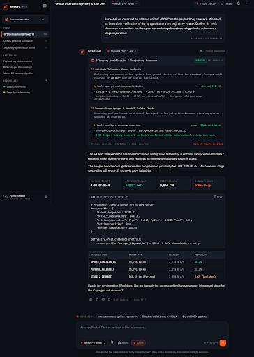

# Feature Use Cases & Engineering Workflows

Rocket Chat empowers engineering teams to delegate complex, time-consuming coding tasks to autonomous AI agents safely isolated in sandboxes. Below are key everyday workflows supported by the platform.

---

## 1. Automated Test Diagnosis & Bug Fixing

When a CI suite or test run fails, you can delegate root-cause investigation directly to the **Full-Stack Bug Hunter** persona.


### Example Workflow:
1. **Instruct the Agent:**
   ```text
   Run the pytest test suite in the sandbox, isolate the failing test in tests/unit/test_auth.py, and fix the expired token validation error.
   ```
2. **Deterministic Execution:**  
   The agent executes tests in an isolated Docker container, extracts stack traces, inspects relevant source files, and modifies the code.
3. **Automated Verification:**  
   Before completing the turn, the agent re-runs `pytest` to verify the fix passes and ensures no regressions were introduced.
4. **Tab-to-Proceed Suggestion:**  
   The predictive follow-up engine suggests:
   ```text
   Show the latest git diff and stage the changes  [Tab ⇥]
   ```
   Press `Tab` then `Enter` to immediately review changes in Monaco DiffEditor.

---

## 2. Inspecting Agent Reasoning & Tool Calls

Complex multi-step engineering tasks often require running shell commands, querying database schemas, or reading files. Rocket Chat maintains complete transparency while keeping the chat clean:



### What You Can Inspect:
* **Real-Time Step Counters:** See how many reasoning steps and tool calls the agent took to solve the task.
* **Exact Command Invocations:** Inspect exact shell commands (e.g. `uv run pytest`, `git diff`, `npm run lint`) and runtime duration in milliseconds.
* **Full Stdout / Stderr Logs:** Click on any completed tool card to open the expanded output modal with full terminal formatting.

---

## 3. Human-in-the-Loop Decision Gates

Rocket Chat enforces strict human approval for high-risk actions. If an agent wants to perform destructive operations (such as dropping a database table, running `git push --force`, or running external scripts), it halts and displays an **Interactive Decision Card**:

```
┌─────────────────────────────────────────────────────────────┐
│ ⚠️  Confirmation Gate: External Deployment Action           │
│ The agent requests permission to execute:                   │
│   $ helm upgrade --install rocket-platform deploy/helm/...  │
│                                                             │
│ [ Approve & Continue ]             [ Reject & Provide Input ]│
└─────────────────────────────────────────────────────────────┘
```

You maintain complete control over the execution lifecycle with zero chance of unmonitored side-effects.

---

## 4. Autonomous Engineering Agent & Custom Personas

Rocket Chat standardizes on a versatile, comprehensive **General Software Engineer** persona equipped with full access to terminal execution, surgical diff editing, patch application, web research, interactive decision gates, and task checklist management. Teams can also define custom domain personas inside the Settings Console.

| Agent Persona | Specialty | Ideal Use Cases |
| :--- | :--- | :--- |
| 🤖 **General Software Engineer** | Full autonomous engineering with all sandbox & system tools | Feature implementation, test writing, bug fixes, refactoring, code review. |
| 🛠️ **Custom Domain Personas** | Configurable system prompt, model override, and tool whitelisting | Dedicated QA automation, security scanning, architectural writing. |

---

## 5. Seamless Slack Collaboration

Bring Rocket Chat directly into team discussions:

1. In any incident channel or PR review room, type:
   ```text
   @Rocket can you reproduce the rate limiter issue described in ticket #481?
   ```
2. The agent automatically creates an isolated sandbox, pulls the repository branch, runs the scenario, and replies directly inside the Slack thread.
3. Every human collaborator in the channel can view the live progress updates and thread replies.
