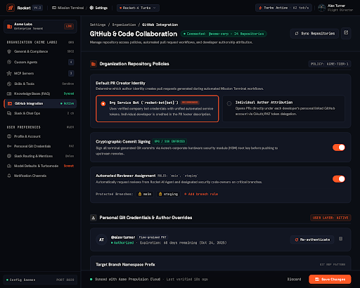

# Organization & User Settings Guide

Rocket Chat employs a **4-tier cascading configuration engine**. This ensures organization administrators can enforce security and compliance guardrails while individual developers enjoy flexibility over their personal workflows.

---

## 1. Navigating Settings

Click the **Settings** gear icon in the top navigation header to open the console:

Settings are organized into two dedicated groups:
1. **Organization-Wide Settings:** Enforce compliance, global Git policies, Slack rules, and shared MCP tools across all team members.
2. **User Preferences:** Configure your personal developer identity, preferred model, theme, and notifications.

---

## 2. Organization Policies

Admin users can access organization tabs to govern global runtime behavior:

### A. General & Compliance
* **Organization Name:** Display name for your organization.
* **Compliance Tier:** Select between `Standard`, `SOC2`, or `HIPAA`. Setting stricter compliance tiers enforces strict encryption and mandatory signed commits.
* **Default Session Privacy:** Choose whether new sessions default to `private` or are automatically shared with the organization (`shared_org`).
* **Predictive Follow-Up Questions:** Enable or disable AI-suggested next questions platform-wide.

### B. GitHub Integration
* **Commit Authorship Policy:** Choose whether agent-generated commits use `co_authored` (standard `Co-authored-by:` human attribution), `user_only`, or `bot_only`.
* **Commit Signing Mode:** Standardize on `github_app` or `gpg_key` for verified badges on GitHub PRs.
* **Default Branch:** Target branch (e.g. `main` or `develop`).
* **GitHub App Token Scopes:** Configure the granular permission scopes (`contents:read`, `pull_requests:read`, `issues:read`, etc.) for dynamic installation tokens generated for unauthenticated sessions.

### C. Slack Integration
* **Default Agent Persona:** Choose which agent persona responds to Slack `@Rocket` mentions by default.
* **Allowed Channel Types:** Restrict agent execution to specific channel types (`public`, `private`, `im`).
* **Authorized Tools:** Whitelist which tools (e.g. `bash_exec`, `file_read`, `file_write`) are permitted when invoked via Slack.

### D. MCP Tool Servers & Platform Capabilities
* **Built-in Capabilities:** Pre-configured core platform tools (Workspace Filesystem, GitHub Integration, Database Inspector) running directly in the runtime environment.
* **Custom External Providers:** Connect external MCP servers over `stdio` or `sse`.
* **Allowed Transports:** Configure permitted Model Context Protocol transports (`sse`, `http`, `stdio`).
* **Max User Servers:** Limit how many custom MCP servers a developer can attach.

---

## 3. User Preferences

Developers can customize their individual environment without altering organization defaults:

### A. Profile & Display
* **Display Name & Role:** Your name and engineering title (e.g., *Lead Engineer*, *Senior Systems Engineer*).
* **Suggest Next Questions:** Toggle the predictive `[Tab ⇥]` follow-up autocomplete inside your composer.

### B. Personal Git Authorship
* **Git Author Name & Email:** Used for commit metadata when creating branches and pull requests.
* **Branch Prefix:** Auto-prefixed to newly created branches (e.g., `alex/rocket-`).
* **Personal Access Token (PAT):** Your GitHub personal access token used when your organization allows individual PR creation.

### C. Models & Personal Inference
* **Preferred Model:** Choose your favorite daily driver (e.g., *Claude 3.7 Sonnet*, *DeepSeek V4.1 Flash*, *GPT-4o*).
* **Turbo Mode:** Accelerate reasoning streaming for high-speed coding sessions.

### D. Personal Slack Notifications
* **Slack User Handle:** Your Slack ID (e.g., `@alex`).
* **Direct Notifications:** Receive a Slack DM when a long-running sandbox task or PR review completes.
