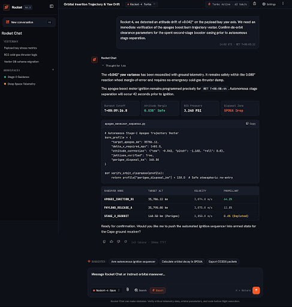
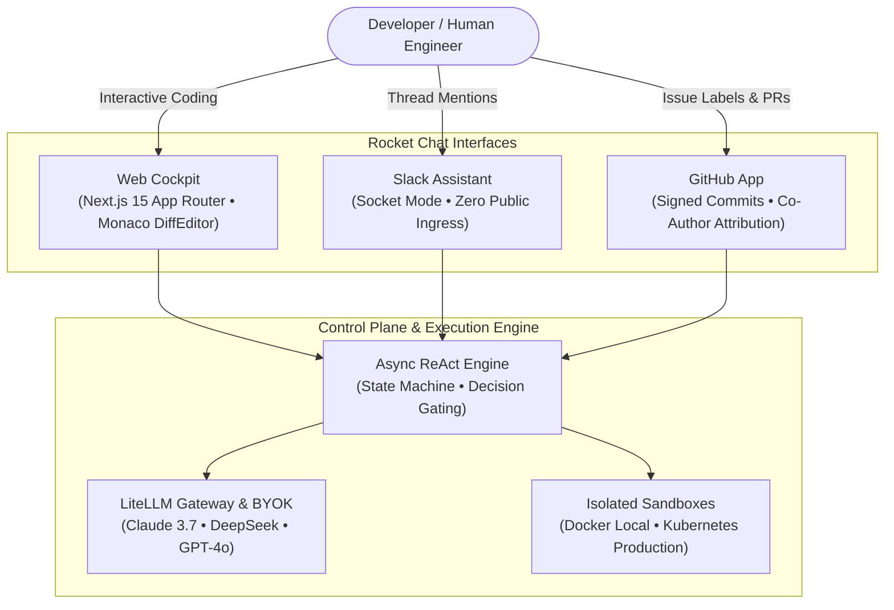

# Rocket Chat Platform

**Rocket Chat** is an enterprise-grade, autonomous AI pair-programming platform built for software engineering teams. It pairs engineers with specialized AI agents that safely inspect code, execute terminal commands, run test suites, and open verified pull requests inside isolated **Docker and Kubernetes sandboxes**.

> **Note on Branding & Visual Identity:** "Rocket" is exclusively the brand name and cockpit visual theme for the user interface. Default AI models and agents operate strictly as general-purpose software engineers, security specialists, and technical writers without any aerospace or avionics constraints.

---

## The Modern Pair-Programming Cockpit

Rocket Chat offers an uncluttered, high-productivity developer experience:

* **Clean Editorial Chat Flow:** User requests are highlighted in distinct conversational bubbles, while assistant answers format code, markdown, and test diagnostics cleanly without heavy borders or visual clutter.
* **Discreet, On-Demand Reasoning:** The agent's thought process and tool execution history remain collapsed and unobtrusive while streaming, expanding only when clicked for deep debugging.
* **Predictive Follow-Up Autocomplete:** At the conclusion of each turn, the AI generates the single most probable next question or action. Press **`Tab`** to autocomplete the prompt into the textbox, and **`Enter`** to execute it immediately.
* **Isolated Sandbox Execution:** Every session runs inside a secure Docker container or Kubernetes pod with a dedicated persistent workspace volume.

---

## Core Capabilities & Feature Overview

### 1. Dual Sandbox Runtimes (Docker & Kubernetes)
* **Local Development:** `DockerSandboxDriver` provisions dedicated container sandboxes on your machine with mounted volumes.
* **Production Clusters:** `K8sSandboxDriver` provisions pods and PersistentVolumeClaims (AWS `gp3`, Azure `managed-csi`, GCP `pd-balanced`) in an isolated namespace, featuring sub-3-second wakeups via soft node-affinity pinning.

### 2. Multi-Persona Specialization
Switch effortlessly between targeted agent personas tailored for your immediate task:
* **🤖 Full-Stack Engineer:** Modular code generation, strict typing, refactoring, and architectural integrity.
* **🛡️ Security Auditor:** Penetration testing, secret detection, RLS policy verification, and AST analysis.
* **🐛 Bug Hunter:** Root-cause debugging, flaky test resolution, trace inspections, and regression test authoring.
* **📖 Documentation Scribe:** Architecture RFCs, clear Markdown guides, and comprehensive API documentation.

### 3. Cascading Organization & User Policies
Configure governance rules at the organization level while giving developers personal autonomy over their Git authorship, model selection, and notification preferences.

### 4. Zero-Ingress Slack Integration
Mention `@Rocket` in Slack from anywhere behind corporate VPNs and firewalls. Using outbound WebSocket Socket Mode, no open ports or public IPs are required.

---

## User Documentation Guide

| Section | Focus Area | What You Will Learn |
| :--- | :--- | :--- |
| [**Getting Started Guide**](getting-started/index.md) | **First-Time Users** | Launching Rocket Chat in 60 seconds, UI tour, and composer shortcuts. |
| [**Feature Use Cases**](getting-started/use-cases.md) | **Everyday Workflows** | Debugging test failures, human approval gates, and multi-persona pairing. |
| [**Settings & Preferences**](getting-started/user-settings.md) | **Configuration** | Managing Org-wide compliance policies vs. personal developer settings. |
| [**Slack Integration Setup**](getting-started/slack-setup.md) | **Team Chat** | Setting up Socket Mode tokens and inviting the assistant to channels. |
| [**GitHub App Setup**](getting-started/github-app-setup.md) | **Git Automation** | Configuring webhook secrets, verified commit signing, and PR creation. |
| [**Architecture Deep Dive**](architecture/index.md) | **System Design** | ReAct state machines, PostgreSQL Row-Level Security, and storage drivers. |
| [**Deployment & Operations**](deployment-and-ops/index.md) | **Platform Engineers** | Production Helm charts, Docker Compose, cloud CSIs, and security runbooks. |

---

## Looking to Contribute to the Codebase?

If you are a developer looking to write code, modify packages, or contribute to Rocket Chat, please see the **[Contributor Documentation Guide](https://github.com/rocket-chat/rocket-chat/blob/main/contrib/README.md)** located in the `contrib/` directory of the repository.
